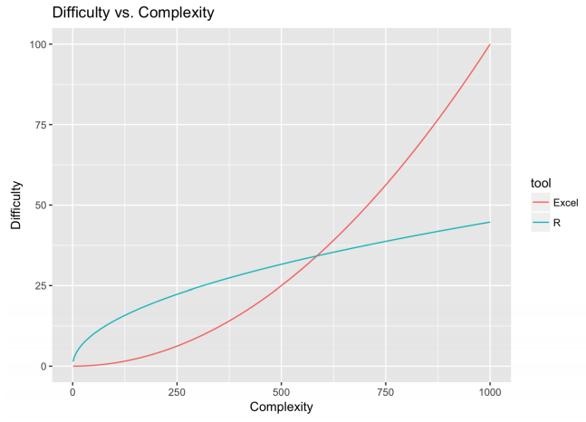

# Programas estatísticos  

::: {.objectives data-latex="" }
**Objetivos do capítulo**  
1. Apresentar os programas estatísticos utilizados durante o livro      
2. Discutir características do R, tidyverse e seus pacotes     
3. Discutir características do JASP      
:::
 
Programas estatísticos são ferramentas indispensáveis tanto na gestão, como na análise dos dados resultantes de uma pesquisa. Eles servem para otimizar o tempo gasto nas etapas analíticas de uma pesquisa, apesar de, em menor escala, permitirem a execução de análises inadequadas. No dia a dia de um pesquisador, apenas muito raramente as análises são feitas manualmente. Dessa maneira, o conhecimento de programas de análise de dados faz parte das competências esperadas para quem deseja ou precisa trabalhar com estatística.  

Atualmente, há muitos programas e pacotes estatísticos disponíveis para uso. Acredito que a maioria deles tenha mais similaridades do que diferenças e produzam resultados confiáveis. Neste livro, o R e o JASP serão utilizados e algumas de suas características serão descritas neste capítulo.  

## O R 

O R é uma linguagem de programação focada em análises estatísticas, que vem ganhando popularidade entre pesquisadores e cientistas. Este livro foi integralmente feito e baseado no ambiente R que, apesar de ainda não ser o programa mais frequente em Psicologia, apresenta diversas vantagens em comparação aos programas mais usuais.

* o R e todos os seus pacotes e otimizações são gratuitos.   
    
* o R é uma linguagem de programação desenvolvida especificamente para Estatística.  
    + Diferente de uma linguagem mais geral (por exemplo, Python) ou de um programa *point and click*, o R é uma linguagem focada em análise estatística. Ao se programar utilizando o R, o usuário tem controle total das ações realizadas e dos resultados obtidos. Assim, raramente o R apresentará resultados excessivos e distantes das análises solicitadas. Apesar disso poder assustar no início, acredito que essa característica seja essencial e, inclusive, serve como um excelente auxílio pedagógico para que o estudante planeje adequadamente as análises de interesse, em vez de apenas selecionar parte de um *output* padronizado, como ocorre com o SPSS.  
    
      
* O R é um programa de nicho em Estatística. Essa característica faz com que ele seja absolutamente adaptado para o dia a dia em estatística, incluindo não apenas análises descritivas e inferenciais, mas também análises para simulação e controle de resultados.  
    
+ O R permite o desenvolvimento de interfaces web e aplicativos.     

* O R tem diversos pacotes.  
    + Pacotes são complementos que permitem otimizar as análises que o R faz. A comunidade R tem um exército de pacotes, que além de gratuitos, foram verificados publicamente. O ambiente CRAN (*The Comprehensive R Archive Network*) é o local em que estes pacotes estão alocados. Neste livro, todos os capítulos contam com pacotes específicos, que permitiram que análises complexas fossem realizadas com poucos comandos.   
  
    
* O R possui uma enorme comunidade de apoio.  
    + Os usuários do R formam uma rede muito dinâmica e que oferece grande apoio em caso das mais diversas dúvidas. A comunidade  [stackoverflow](https://stackoverflow.com/) talvez seja a mais voluma e reúne pessoas de todas as nacionalidades.  

Para baixar o R, é necessário ir no site [https://cran.r-project.org/](https://cran.r-project.org/). Em seguida, para baixar o R Studio, é necessário acessar [https://rstudio.com/](https://rstudio.com/).

## Tidyverse  

O Tidyverse é um ambiente de pacotes. Eles funcionam de maneira totalmente integrada e permitem que a estrutura da programação seja mais intuitiva e próxima à forma pela qual pensamos. No Tidyverse, os códigos seguem a lógica de sujeito + verbo e permitem uma programação encadeada, ao se utilizar a ligação *pipe* (`%>%`). Ao instalar o tidyverse `install.package("tidyvese")`, os pacotes abaixo ficam disponíveis no R.

## Dificuldades esperadas  

Algumas dificuldades são esperadas quando se trabalha programação no geral e com o R especificamente. Apesar do R e seus pacotes oferecem excelentes ferramentas para análise de dados, algumas condições descritivas são demasiadamente custosas. Por exemplo, enquanto realizar algumas tabelas e gráficos no Excel é tremendamente fácil, com alguma frequência o R exige diversas linhas de código para isso. 

Nesse sentido, na relação entre dificuldade e complexidade, o R sai na frente em tarefas complexas (como exemplo, estimar os coeficientes de um modelo não-linear), mas talvez perca em tarefas fáceis (por exemplo, gerar uma tabela de contingência). A Figura a seguir apresenta esta relação comparando as análises feitas no R e no Excel.

Além disso, o R traz uma outra barreira importante em aspectos que envolvam o ensino de estatística, especialmente na graduação. Como o R é uma linguagem de programação, o estudante teria de aprender a programar antes de conseguir entender conceitos de pesquisa e a utilidade da estatística. Isso poderia impactar negativamente na motivação do estudante, principalmente àqueles com uma aversão *a priori* da matéria, 

Em situações como esta, talvez o ideal seja começar motivando o estudante a entender como a estatística é uma ferramenta importante para tomar decisões para, só depois e lentamente, apresentar aspectos matemáticos e computacionais.

## Verbos do dplyr

Entre os pacotes do ambiente tidyverse, o dplyr é o que será mais utilizado. Este pacote funciona de maneira muito intuitiva, em que as funções dependem de uma estrutura `sujeito %>% verbo(complemento)`. Essa é uma diferença importante em relação ao R Base. Por exemplo, no R Base é necessário executar `names(dataset)` para verificar as variáveis de um conjunto de dados. Pelo dplyr deve-se utilizar `dataset %>% names`.

O dplyr funciona a partir de verbos declarativos e os principais estão listados na tabela a seguir. As sintaxes deixadas no decorrer do livro também permitem uma melhor apreensão das funcionalidades. 

| Verbo         | Ação          
| :------------ | :----------
| glimpse       | Inspeciona os dados 
| count         | Conta os níveis de uma variável 
| select        | seleciona uma variável específica 
| filter        | Filtra os resultados por um nível específico de uma variável 
| group_by      | Agrupa os resultados por níveis de uma variávei específica  
| summarise     | Apresenta sumários (com medidas estatísticas)  
| mutate        | Cria novas variáveis ou altera as existentes
| arrange       | Organiza a apresentação dos resultados  
| left_join     | Junta bases ou colunas  
| pivot_longer  | Transforma uma base larga em longa  
| pivot_wider   | Transforma uma base longa em larga  

*Nota: Em alguns momentos, em função da praticidade computacional, algumas sintaxes vão contar com o formato base do R.*

É importante ficar atento às atualizações do dplyr e do sistema tidyverse como um todo. Eventualmente, mudanças podem ocorrer e impossibilitar (ou dificultar) a reprodução de rotinas antigas.   

## O JASP  

O JASP é um programa gratuito, com uma interface amigável, *point and click* e altamente versátil para a maioria das análises realizadas. A versão utilizada neste livro é a 0.14.1. O JASP foi desenvolvido por um time de psicólogos e estatísticos liderados pelo Prof. Eric-Jan Wagenmakers, da Universidade de Amsterdam. Isso talvez explique o motivo pelo qual o JASP vem sendo cada vez mais utilizado em análises de dados psicológicos e na docência de matérias relacionadas a métodos estatísticos.

Para baixar o JASP, é necessário acessar [https://jasp-stats.org/download/](https://jasp-stats.org/download/).  

Quando se instala o JASP no computador, se instala também o R. Todas as ações feitas no JASP se transformam em linhas de código que são enviadas ao R e, em seguida, retornam pro JASP e são apresentadas na tela. Isso ocorre de maneira instantânea e não há nenhum incômodo para o usuário. Na maioria das vezes, computadores pessoais conseguem rodar o JASP sem grandes problemas.

O idioma oficial do JASP é o inglês e, nesta versão, não pode ser alterado. Para fazer qualquer análise, é necessário carregar um arquivo de dados. Isso pode ser feito no símbolo das três linhas, localizado na parte superior à esquerda.

A opção `open` permite que se acesse algum diretório local específico ou se baixe os dados diretos da plataforma *Open Science Framework (OSF)*. Esta versão do JASP aceita, majoritariamente, arquivos em CSV, que indica que os dados são separados por vírgulas.

Ao abrir algum arquivo de dados, o JASP irá apresentar os dados no centro do programa e as opções de análise na parte superior. Tenha atenção que essas telas podem variar de versão para versão. 

Em relação aos dados, quase sempre o formato utilizado é o largo. Neste formato, cada coluna representa uma variável, cada linha representa um caso e cada célula (ou vetor) apresenta um valor específico.  

O JASP adota uma simbologia específica para definir a escala (ou nível) de medida das variáveis. Isso pode ser visto no símbolo ao lado dos nomes das variáveis. Para alterar o nível, basta clicar sobre o símbolo. 

É possível também alterar valores e rótulos das variáveis. Para isso, basta clicar no centro da variável. Uma seção na parte de cima do programa será exibida. Para fechar, é necessário clicar no X ao lado direito.     

Na parte superior, o JASP oferece as análises possíveis. As opções podem variar de versão para versão, mas as principais tendem a ser as seguintes.

É possível adicionar módulos e complementos no JASP. Essas adições funcionam de maneira análoga aos pacotes do R. Para fazer isso, basta clicar na cruz azul ao lado direito.

Uma barra ao lado direito irá ser exibida. Qualquer opção pode ser selecionada e, ao fazer isso, novos botões irão aparecer na parte superior do programa. 

Finalmente, para salvar o trabalho realizado em uma sessão, deve-se clicar na símbolo de três linhas azuis e, em seguida, clicar em `Save as` e selecionar a pasta.. Por padrão, o formato do arquivo sera *.jasp.

## Resumo  
::: {.explore}
1. Há muitos programas e pacotes de estatística. Neste livro, o R e o JASP serão utilizados.  
2. O R é gratuito e pode ser complementado por pacotes adicinais.   
4. O tidyverse servirá como principal ecossistema de programação.    
3. O JASP tem recebido grande atenção especialmente em Psicologia e as análises também serão feitas nele.  
::: 
