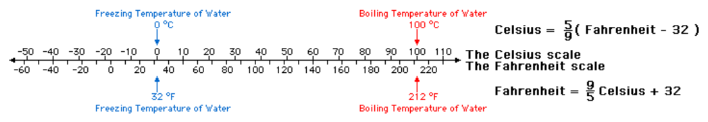
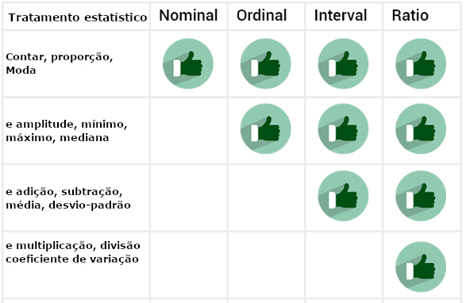

# Aspectos gerais  

::: {.objectives data-latex="" }
**Objetivos do capítulo**  
1. Apresentar conceitos transversais encontrados em pesquisa e estatística    
2. Descrever as variáveis em função de seu relacionamento, escala de medida e capacidade numérica  
3. Introduzir o debate sobre a escala de medida em Psicologia  
4. Apresentar as duas principais áreas da estatística
:::

::: {.glossario }
<U>**GLOSSÁRIO**</U>   
**Pesquisa**: Procedimento racional e sistemático de investigação que visa proporcionar respostas específicas a um conjunto de problemas propostos.  
**Modelo teórico**: Representação visual, matemática, computacional ou experimental de um sistema de ideias, eventos ou fenômenos.  
**Instrumentos científicos**: Ferramentas que permitem amplificar o fenômeno de interesse, além de acessar aspectos da realidade que não podem ser percebidos diretamente.  
**Variável aleatória**: É uma variável que está associada a uma distribuição de probabilidade.  
**Variável**: Termo genérico usado para se referir às características que estão sendo investigadas ou para se referir às variáveis aleatórias.   
**Variável Independente (VI)**: Característica que está sendo manipulada. Entende-se que ela influencia, afeta ou determina outras variáveis.  
**Variável dependente (VD)**:   Variável que sofre efeito da VI. Seus valores dependem dos níveis da VI.  
**Delineamento de pesquisa** Forma de esquematizar o planejamento da pesquisa, especialmente considerando o acesso e controle das variáveis, bem como a coleta e análise de dados.   
::: 

Quando as pessoas começam seus estudos em estatística, parece haver uma falsa crença de que a estatística é uma área exclusivamente desenvolvida para analisar dados obtidos em uma pesquisa. Este pensamento acaba por produzir uma dicotomia entre pesquisa e estatística, fazendo com que algumas pessoas pensem que as atividades feitas em estatística somente começam após o termino de uma pesquisa. No entanto, isso não é verdade. Apesar da análise de dados ser uma tarefa intensamente feita em estatística, a atuação desta ciência é muito mais ampla do que apenas isso e ocorre em todas as etapas de uma pesquisa.    

Em linhas gerais, a estatística é a ciência que fornece os princípios e a metodologia para <u>coleta</u>, <u>organização</u>, <u>apresentação</u>, <u>resumo</u>, <u>tratamento</u>, <u>análise</u> e <u>interpretação de dados</u>. O mnemônico <mark>CORRETA</mark> quase sempre ajuda a fixar esta definição, já que C se refere à coleta, O se refere à organização, R se refere à resumo, T se refere à tratamento e A se refere à análise, incluindo aspectos descritivos, inferenciais e suas respectivas interpretações, que serão discutidas posteriormente. Assim, aprender estatística da forma "correta" é muito importante no meio acadêmico e científico.   

::: {.warning}
**Atenção**: A estatística atua em todas as etapas da pesquisa, incluindo o planejamento, execução e análises. O mnemônico CORRETA auxilia a lembrar as principais atividades desempenhadas pela estatística.     
:::

Uma vez que o conjunto de atividades possíveis em estatística é bastante longo, é possível distinguir acadêmicos cujos interesses são mais relacionados à <mark>estatística como ciência</marK> daqueles cujos interessem recaem mais na utilização da <mark>estatística na ciência</mark>. Com frequência, estudantes do bacharelado de estatística ou matemática tendem a fazer parte do primeiro grupo, enquanto estudantes de áreas mais aplicadas, incluindo aqui Psicologia, tendem a fazer parte do segundo grupo. Apesar dos conceitos principais da estatística serem os mesmos, essa distinção serve como uma bússola metodológica para orientar a forma pela qual esses conceitos serão introduzidos e discutidos.

Isso posto, os subtópicos a seguir introduzem conceitos gerais e importantes que costumam ser apresentados antes mesmo de aspectos mais voltados à análise de dados. Uma vez que esses conceitos são transversais, é possível também encontrar essa discussão em livros de métodos de pesquisa e história da ciência. 

A apresentação e descrição desses temas será feita de maneira sucinta. As referências bibliográficas dispostas ao fim do capítulo servem para o aprofundamento teórico entre aqueles interessados.   

## Os objetivos de uma pesquisa 

Uma pesquisa é um procedimento racional e sistemático de investigação que visa proporcionar respostas específicas a um conjunto de problemas propostos [@gil2002]. Toda pesquisa depende da eleição de problemas, bem como da coleta e análise de dados.

Uma das principais condições a se definir antes de se iniciar uma pesquisa é o seu <u>objetivo geral</u> ou <u>nível</u>. Neste sentido, é possível listar 3 grandes grupos de pesquisas, que são as (1) pesquisas exploratórias, (2) pesquisas descritivas e (3) pesquisas explicativas. É importante ter atenção que o termo "objetivo da pesquisa" utilizado nesta seção se refere à forma de organização das pesquisas. Ele não é totalmente conectado com os objetivos de um pesquisador, que se volta mais às perguntas científicas que motivaram a execução da pesquisa.  

A tabela a seguir sintetiza as principais características de cada um desses tipos.    

  | Tipo de Pesquisa| Quando é feita                                             | Características principais               
  | :-----------    | :-----------                                               | :-----------                        
  | Exploratória    | Há pouco ou nenhum conhecimento sobre o tema de interesse. | Não há hipóteses definidas previamente. Os resultados proporcionam maior familiaridade com o problema, apesar de frágeis e pouco generalizáveis.  
  | Descritiva      | Os fenômenos e objetos já são mais conhecidos. Hipóteses sobre suas características e eventuais relacionamentos podem ser feitas. | Técnicas de coleta de dados mais padronizadas tendem a ser empregadas. Testes de hipóteses são feitos, bem como técnicas estatísticas descritivas e que visem comparar características entre grupos e pessoas diferentes.     
   | Explicativa    | Há maior conhecimento sobre o tema de interesse e a finalidade é indicar possíveis relações de causa e efeito | O delineamento experimental tende a ser implementado, o que será explicado posteriormente     
 

É possível notar que o objetivo da pesquisa indica um pouco a maturidade da área cientifica em questão e a recenticidade que o fenômeno a ser estudado representa. Apesar de não ser uma regra geral, pesquisas exploratórias tendem a ser feitas por ciências mais novas e/ou para estudar fenômenos e objetos em que há pouco conhecimento científico sobre. Tenha atenção que a baixa quantidade de conhecimento se refere a aspectos acadêmicos e científicos, e não a quantidade de conhecimento que os autores da pesquisa apresentam sobre seu objeto de investigação. 

Muitas pesquisas em Psicologia são exploratórias. Explorar quantas e quais funções executivas estão presentes em crianças com autismo [@Skogli2020] ou quais são as atitudes de professores em relação ao ensino de ciência [@Jones1994] retratam bem pesquisas exploratórias. No entanto, mesmo áreas com maior maturidade científica podem realizar pesquisas exploratórias quando o fenômeno a ser estudado é recente. Por exemplo, a eventual relação entre o Zica Vírus e o desenvolvimento de microcefalia nos anos 2015 proporcionou a realização de muitas pesquisas exploratórias em biologia e medicina. 

Pesquisas com objetivos descritivos indicam que o fenômeno ou objeto investigado já é mais conhecido pela comunidade científica. Elas são úteis para apresentar o perfil de determinado fenômeno ou objeto, bem como verificar a relação entre variáveis. As pesquisas de intenção de votos, survey sobre opiniões e atitudes sociais e indicadores de prevalência de condições de saúde retratam bem este tipo de pesquisa. 

Pesquisas explicativas visam identificar os fatores que determinam ou que contribuem para a ocorrência dos fenômenos [@gil2002]. Esse é o tipo de pesquisa que mais aprofunda o conhecimento da realidade e, consequentemente, é a mais complexa de ser realizada. Estudar fenômenos termodinâmicos, tal como a transformação de um tipo de energia em outra, ou como o processo de detecção de um estímulo se dá [Madsen1988] ou qual é o efeito de programas de televisão na agressividade de crianças [-@Bandura1961] retratam pesquisas explicativas.   

## A dimensão temporal de uma pesquisa

A unidade de tempo de uma pesquisa é um fator importante a ser definido antes de sua execução e a pesquisa pode ser transversal ou longitudinal. Estudos transversais são também chamados de *Cross-sectional* e descrevem uma situação ou fenômeno em um momento específico do tempo. Estudos longitudinais são também chamados de *follow-up* e  contam com uma sequência temporal previamente definida. A imagem a seguir apresenta este conceito.

A realização de cada tipo de estudo é atrelada à pergunta a qual ele visa responder. A tabela abaixo apresenta algumas características.

  | Característica | Transversal          | Longitudinal             
  | :-----------   | :----------          | :-----------                        
  | Duração        | Um único momento.      | Múltiplos momentos.
  | Amostra        | Varia em cada estudo.       | Mesmos participantes.  
  | Resultados     | Mostram uma fotografia momentãnea      | Indicam detalhes da mudança das variáveis.  
  | Vantagens      | - Tende a ser mais barata. -Rápida. -Participantes são mais fáceis de serem amostrados. - Menos condições burocráticas (Comissão ética, etc). | -Mudanças podem ser descritas. -Maior detalhamento dos resultados. -Pode indicar causalidade 
  | Desvantagens   | -Pouco nível de detalhamento. -Impossibilidade de analisar mudanças. -Dificuldade de verificar aspectos de causalidade. | -Consome tempo e dinheiro para execução. -Perda amostral tende a ocorrer com frequência. -Maior burocracia (Comissão ética, etc). -Definição de intervalo de tempo difícil.  

Com regularidade, pesquisas longitudinais se aproximam mais de objetivos (ou nível) explicativos, enquanto pesquisas transversais são mais próximas a objetivos exploratórios e descritivos.  

## conceitos fundamentais   
- *L. Anunciação & J. Landeira-Fernandez* 

Existem alguns conceitos muito utilizados em pesquisa e estatística que servem como fundações da maior parte dos métodos e técnicas implementados quando se deseja investigar um determinado fenômeno ou objeto através do método científico. Apesar de manuais técnicos divergirem em quantos e quais conceitos podem ser entendidos como fundamentais em pesquisa e estatística, existe grande concordância em relação à (1) realidade e modelo e (2) constante e variáveis. Ambos serão introduzidos a seguir.     

### Modelos científicos

Quando uma pesquisa é feita, ela visa responder uma pergunta específica sobre um fenômeno ou objeto, tal como apresentado anteriormente. Muitas perguntas são possíveis a depender da área de interesse do investigador, bem como de sua época. Físicos e astrônomos do século XVI queriam investigar a organização do sistema solar, economistas do século XVIII tinham interesse em investigar a relação entre recursos e rendimentos financeiros e, mais recentemente, psicólogos do século XX se debruçaram a estudar o efeito da escolaridade no desenvolvimento de habilidades cognitivas. Esses três exemplos remontam à teoria heliocêntrica, a lei dos retornos marginais decrescentes e a teoria da reserva cognitiva.  

Apesar da diferença entre os interesses, uma característica compartilhada nestas pesquisas é a impossibilidade ou improbabilidade de se investigar diretamente a realidade. No exemplo da astronomia isso parece ser bastante claro, já que mesmo que pesquisas em física tenham características mais mecanicistas, só atualmente que o acesso mais preciso da realidade foi possível e permitiu responder melhor essa questão. Além disso, na grande maioria das pesquisas, os fenômenos e objetos de interesse não são sistemas fechados. Isso significa que não é possível ou viável controlar todos os fatores relacionados ao que se tem interesse de estudar. Por exemplo, quando se investiga como a escolaridade impacta nas habilidades cognitivas, os resultados podem (ou não) responder apenas inicialmente sobre um dos fatores relacionado às habilidades cognitivas, mas não todos.

Entre as maneiras desenvolvidas por cientistas para lidar com esta situação estão a <u>construção de modelos teóricos</u> e <u>instrumentos de medida</u>. Modelos teóricos científicos são representações da realidade e podem ser criados sob perspectiva visual, matemática, computacional ou experimental [@Weisberg2013]. Eles tendem a ser sistemas fechados e visam reproduzir, precisamente, o fenômeno ou objeto de interesse. A qualidade desses modelos pode variar e entre as principais características positivas de um modelo com alta aderência à realidade estão a possibilidade de se realizar simulações e também fazer predições com ele [@Heidemann2016]. 

A figura a seguir apresenta algumas características dos modelos científicos.  

Em um modelo ideal, aquilo que fosse descoberto a partir dele, ocorreria identicamente na realidade. Evidentemente, modelos ideais não existem na grande maioria das áreas científicas, o que leva à conclusão de que os modelos são absolutamente essenciais à pesquisa, apesar de possuírem limitações [@Putnam1980; @Feigelson1992; @Firgg2020]. Por exemplo, engenheiros utilizam modelos computacionais com muita frequência para verificar itens de segurança de um carro; economistas utilizam modelos matemáticos (e também jogos!) para investigar características da tomada de decisão e psicólogos utilizam modelos experimentais e matemáticos para investigar transtornos mentais e desenvolvimento de funções emocionais e cognitivas.   

Ainda neste sentido, mapas cartográficos ilustram bem a importância dos modelos. Apesar de todos os mapas disponíveis distorcerem um pouco a área e localização dos continentes, a utilização deles é fundamental tanto na ciência como no dia-a-dia das pessoas. Na figura a seguir, o mapa à esquerda apresenta a projeção de Marcator, que é a mais utilizada nos livros. À direta, a projeção de Peters, que apesar de não ser tão utilizada, é a que melhor organiza o tamanho e o local dos continentes.   

 

 
Além disso, quase sempre, o registro que temos da realidade é baseado em nossos órgãos sensoriais que, por sua vez, são influenciados pela cultura em que estamos inseridos e pela aprendizagem prévia pela qual passamos. Com isso é fácil notar que existe um grande hiato entre a realidade e nossa percepção da realidade. Os instrumentos de medida, por sua vez, são recursos tecnológicos que permitem uma avaliação mais detalhada do fenômeno ou do objeto de investigação, além de gerarem dados que podem ser analisados, comparados e compartilhados. Todas as áreas científicas criam e refinam instrumentos de medida e há autores que sugerem que a existência e a qualidade de tais recursos indicam o quão madura e desenvolvida uma área se encontra, uma vez que os instrumentos são condições centrais no processo científico [@Bergenholtz2018]. Apesar de grande variabilidade em relação à acurácia e precisão dos instrumentos, relógios, bússolas, réguas e testes psicológicos permitem um acesso mais detalhado de um fenômeno ou objeto de interesse.

 

Dessa maneira, a principal proposta dos instrumentos de medida é a captura da realidade sem interferência ou ruídos e, em seguida, a produção de dados confiáveis sobre o fenômeno ou objeto estudado. Existe uma grande translação entre modelos teóricos e instrumentos de medida. Apesar de não ser uma regra geral, muitas áreas científicas primeiro constroem modelos teóricos e o processo de medida ocorre nestes modelos. Por exemplo, há um conjunto de modelos psicológicos visando entender como ocorre o esquecimento que, por sua vez, permitiram desenvolver testes e escalas específicas para isso.   

Um dos exemplos mais interessantes sobre a limitação que nossos sentidos possuem ao capturar a realidade e a importância do desenvolvimento de instrumentos de medida é percepção que temos do sol. A maioria das representações feitas do sol o apresentam como amarelo, quando na verdade ele é branco. Isso ocorre em função da atmosfera do planeta Terra e de diferentes gases presentes no céu.   

 

Isso posto, o desenvolvimento de modelos teóricos e de instrumentos de medida são atividades essenciais de pesquisadores e cientistas para lidar com a impossibilidade ou improbabilidade de acessar a realidade de forma direta, bem como pela limitação perceptual que temos. Como Popper comenta no livro "Os dois problemas fundamentais da teoria do conhecimento", essas características fazem com que cientistas quase nunca digam que estão em busca da verdade, mas sim que estão em busca de evidências sobre um determinado fenômeno ou objeto.

### Variáveis  

O segundo conceito fundamental pode ser entendido pela dicotomia entre variáveis e constantes. De maneira geral, um fenômeno constante não apresenta dispersão em seus valores. Basta uma única medição para que o comportamento de um fenômeno constante possa ser capturado. Em oposição, fenômenos variáveis podem assumir quaisquer valores em suas características. Enquanto a velocidade da luz e do som é, respectivamente, 324 m/s e 299.792 m/s; a renda, altura ou inteligência das pessoas pode variar bastante. Essa dicotomia poderia também ser vista pelo conceito de modelos determinísticos e probabilísticos ou, superficialmente, em diferenças entre ciências naturais e ciências humanas. Modelos determinísticos são aqueles que as condições iniciais determinam os resultados, enquanto modelos probabilísticos são os que associam probabilidades aos resultados. Em ciências naturais recorre-se menos à noção de probabilidade, enquanto em ciências humanas este é um conceito central.   

Em estatística e pesquisa, o termo variável pode ser entendido tanto de uma maneira bastante informal, como de uma forma mais rigorosa. Informalmente, uma variável é um símbolo que representa uma característica de um determinado objeto, tal como peso, altura, inteligência ou renda. Como essa característica pode apresentar quaisquer, dá-se o nome de variável. No entanto, formalmente em estatística, quando o termo variável é utilizado, o que está em jogo é o conceito de <u>variável aleatória</u>. Por sua vez, este conceito se refere à uma classe de variáveis em que o conjunto possível de suas realizações (ou seja, seus valores ou desfechos) ocorrem de acordo com uma distribuição de probabilidade [@everitt2002cambridge]. Em estatística, uma variável aleatória é uma função que associa elementos do espaço amostral ao conjunto de números reais. 

::: {.warning}
**Atenção**: Uma variável é um símbolo que representa uma característica. Uma variável aleatória é uma variável que possui uma distribuição de probabilidade.       
:::

Dessa maneira, o estudo das variáveis (aleatórias) é central em estatística, seja tanto para análises descritiva, como inferenciais.   

As variáveis podem ser organizadas por seu <u>relacionamento em uma pesquisa</u>, seu <u>nível ou escala de medida</u> e sua <u>capacidade informacional</u>.  

No que se refere ao relacionamento entre as variáveis, inicialmente, é possível classificá-las em independentes e dependentes. Variáveis independentes são abreviadas pela sigla VI e também são chamadas de antecedentes, preditores, fatores ou variáveis manipuladas ou de entrada. Variáveis dependentes são abreviadas por VD e também são chamadas de consequentes, previstas, desfechos ou variáveis medidas ou de saída.   

Os termos VI e VD explicitam que ambas as variáveis são conectadas e que <u>a VI gera ou causa a VD</u>. É justamente por isso que representações matemáticas apresentam a VI por X e a VD por Y, tal como no estudo de funções.  

  

Em alguns fenômenos naturais, é relativamente fácil identificar a VI e a VD. Por exemplo, quanto mais profundo uma pessoa mergulha no mar, mais gelada a água fica. Neste caso, a profundidade seria a VI, enquanto a temperatura da água seria a VD. Da mesma forma, quanto mais alto um avião viaja, menor é a pressão atmosférica. Nesse outro exemplo, a altitude é a VI e a pressão atmosférica é a VD. 

 

No entanto, esses exemplos descritos são oportunos e têm apenas finalidade pedagógica. Na realidade, a definição de VI e VD nem sempre é fácil e, especialmente em ciências humanas e da saúde, isso se torna ainda mais sutil. É possível definir a VI e VD por condições temporais, lógicas ou teóricas [@BabbieEarlR1990], bem como é possível desenvolver pesquisas com características específicas para que essa relação possa ser definida com acurácia, e consequentemente, corretamente medida. 

Como exemplos de uma condição temporal, uma pessoa pode estar interessada em investigar a influência do sexo (VI) na escolha profissional (VD) ou o efeito de um medicamento (VI) na dor de cabeça (VD). Nesses dois casos, os efeitos não podem alterar as causas. Uma escolha profissional não faz com que a pessoa altere seu sexo, bem como a dor de cabeça é uma condição que antecede a tomada do medicamento. 

Em relação à condição lógica (as vezes chamada de quase-temporal), é possível que alguém queira investigar como a escolaridade afeta o preconceito. Neste caso, é viável assumir que a escolaridade é a VI e o preconceito é a VD. Entretanto, alguém pode sugerir que pessoas mais ou menos preconceituosas se dedicam de maneira diferente em atividades acadêmicas, invertendo essa relação de causalidade.   

Finalmente, uma organização teórica ocorre quando se pretende investigar os efeitos da ansiedade na depressão ou do casamento no bem estar pessoal. A eleição da ansiedade como VI foi uma escolha do pesquisador e não, necessariamente, uma condição temporal ou lógica. Da mesma forma, eleger o casamento como VI é uma escolha feita para responder a uma determinada questão. 

A figura a seguir traz um diagrama inicial destes conceitos, utilizando um esquema em que as horas de estudo teriam efeito sobre a nota da prova.  

 

É importante notar que a ideia de uma única variável impactando ou causando diretamente uma outra variável é quase metafórica. Para que isso pudesse ocorrer tanto em fenômenos físicos como em quaisquer outros, seria necessário que todas as possíveis fontes de influência existentes neste relacionamento fossem controladas ou suprimidas [@Dumsday2012]. Essa noção de controle total é vista pelo termo *ceteris paribus*, que é uma expressão em latim que significa "tudo o mais constante". Muitas vezes, em pesquisa e estatística, este termo é utilizado quando alguns ajustes são implementados em modelos estatísticos para tentar expressar a ideia de uma causalidade parcial, em que a VI impactaria a VD de uma determinada forma, caso tudo o mais fosse controlado [@Fennell2005]. Evidentemente, há fenômenos sociais que parecem obedecer à certa regularidade e o termo "fato estilizado" tende a ser empregado nestas situações [@Hirschman2016].  

Ao se pensar nas condições em que a VI e VD estejam definidas, é fácil notar que existe um conjunto grande de outras variáveis que podem impactar neste relacionamento. Essas variáveis recebem muitos nomes e o termo <u>variáveis estranhas</u> (VEs) pode servir para designá-las. A imagem a seguir ilustra algumas das variáveis que poderiam impactar na relação entre horas de estudo e notas na prova, previamente assumidas como VI e VD.  
 

É possível afirmar que em todos os relacionamentos entre duas variáveis, sempre haverá um conjunto de outras variáveis impactando nesta relação. justamente por isso é que cientistas quase nunca digam que estão absolutamente certos de uma determinada condição ou assunto. Na maioria das vezes, como também ilustrado por Popper no livro "Os dois problemas fundamentais da teoria do conhecimento",  cientistas tendem a substituir a palavra certeza por probabilidade.

Para conseguir mapear adequadamente o quanto e como outras variáveis impactam no relacionamento VI-VD em um estudo, é necessário ter claro o objetivo que a pesquisa possui, mas também o delineamento implementado para sua execução, o que será descrito a seguir.

### Delineamentos de pesquisa

O termo delineamento diz respeito a etapa de planejamento de pesquisa em que se "considera o ambiente em que são coletados os dados e as formas de controle das variáveis envolvidas" [@gil2002]. Dessa forma, o delineamento funciona como um manual técnico.  É durante esta etapa que o pesquisador terá a oportunidade de eleger as maneiras pelas quais ele irá executar seu estudo e mapear as principais características e limitações existentes. 

Existem diferentes classificações dos delineamentos de pesquisa e cada área tem particularidades. É importante atentar que definir claramente o tipo de delineamento é essencial, já que os objetivos da pesquisa e as análises estatísticas a serem feitas são conectadas a ele. Em Psicologia, costuma-se organizar os delineamentos em observacionais, correlacionais e experimentais. As vezes, o termo delineamento descritivo é utilizado em vez de observacional [@stangor2010]. Por sua vez, em epidemiologia, saúde pública e bioestatística, os delineamentos costumam ser divididos em experimentais e observacionais [@friis2013; @glantz2014]. Apesar das diferenças de nomenclaturas, a lógica por detrás dos delineamentos é bastante atrelada à possibilidade e viabilidade de uma manipulação ativa da VI. 

Em Psicologia, a tabela abaixo é bastante utilizada:

  | Delineamento    | Característica                              | Vantagens                 |  Limitações    
  | :-----------    | :-----------                                | :-----------              |  :-----------      
  | Observacional   | -Apenas 1 grupo é necessário. -Descrever um determinado fenômeno ou objeto. | -Oferece uma foto de um objeto ou fenômeno que tende a ser precisa. -Permite que novos estudos sejam conduzidos. -Tende a ser mais barato do que outros delineamentos. -As vezes, só é possível fazer este delineamento.  |  -Não acessa o relacionamento entre duas ou mais variáveis.    
  | Correlacional    | -Apenas 1 grupo é necessário. -Permite estudar a natureza e a força do relacionamento entre duas variáveis. -As vezes, só é possível fazer este delineamento. | -É possível testar hipóteses sobre este relacionamento e fazer previsões de resultados futuros. -Não é necessário ambientes ou intervenções específicas. | -Não permite indicar causalidade entre os fenômenos ou objetos estudados.    
  | Experimental     | -São necessários 2 grupos em que os participantes sejam alocados de maneira aleatória. -Existe uma manipulação intencional da VI -nem participantes nem pesquisadores sabem quem está em cada grupo (duplo cego).  | -A aleatorização evita que as variáveis estranhas gerem vieses. -A aleatorização aumenta a probabilidade de ambos os grupos terem participantes com características similares -A comparação entre os grupos permite conclusões sobre causalidade, se assumidas algumas condições. |  -Impossível, impraticável ou até mesmo antiético em algumas situações, especialmente as clínicas. -O custo envolvido costuma ser alto. -O tamanho amostral tende a ser pequeno. -Há uma baixa possibilidade de generalização em pesquisas laboratoriais.

Em Epidemiologia, saúde pública e bioestatística, costuma-se unir o delineamento observacional e correlacional. Assim, apenas os delineamentos observacional e experimental são definidos, apesar de características virtualmente similares. Pessoalmente, acredito que esta definição evita alguns equívocos, como o de achar que em delineamentos observacionais não é possível realizar correlações ou comparações entre grupos.  

Todos os delineamentos possuem características específicas e um conjunto de vantagens e limitações, que serão apresentadas a seguir.

### Delineamentos observacionais (e correlacionais)  

Em delineamentos observacionais (ou observacionais e correlacionais), o pesquisador não intervém nos fenômenos estudados. Ou seja, não há uma manipulação da VI. Estudos que utilizam tal delineamento quase sempre contam com um único grupo e os resultados produzidos auxiliam no entendimento inicial do fenômeno interesse, bem como podem indicar o perfil de relacionamento entre variáveis.     

Uma vez que não há a formação de grupos específicos seguindo um rigoroso controle da VI, o pesquisador deve mapear adequadamente todas as possíveis variáveis estranhas presentes no relacionamento entre VI e VD <u>antes</u> da pesquisa. Assim, na etapa de coleta de dados, ele poderá acessar essas variáveis para, futuramente, implementar controles estatísticos que reduzam distorções que este delineamento gera nos dados. Por exemplo, quando artigos biomédicos comentam que os resultados de um medicamento são efetivos para os participantes, controlando pela idade e sexo, essa conclusão é bem próxima de resultados obtidos por pesquisas cujos delineamentos foram observacionais.     

::: {.warning}
**Atenção**: Em delineamentos observacionais, o mapeamento e acesso de variáveis estranhas auxiliam o pesquisador a implementar técnicas estatísticas que reduzam as distorções que este delineamento costuma produzir aos dados.     
:::

Nota-se que, apesar de diversas técnicas estatísticas serem utilizadas neste delineamento, não é possível falar sobre relação de causa e efeito. Apesar desta limitação, há muitas situações em que apenas este delineamento é possível. Por exemplo, estudar os impactos de um desastre natural (furacão, terremoto, etc) na percepção de segurança das pessoas, avaliar o comportamento de grupos em instituições totais, como prisões e hospícios ou as condições relacionadas ao aleitamento materno.  

Uma vez que as eventuais variáveis estranhas foram previamente acessadas durante a coleta de dados, elas deixam de ser estranhas e tornam-se variáveis passíveis de análises A natureza e o local em que essas variáveis impactam no relacionamento entre a VI e a VD indicam se elas serão classificadas como intervenientes, mediadoras ou moderadoras.  

O termo variável interveniente é bastante circunscrito à Psicologia. Ele tende a ser empregado para caracterizar condições psicológicas, como motivação ou neuroticismo. Assim, este é o termo empregado quando as variáveis estranhas são fatores psicológicos.  

Quando esta variável é uma consequência da VI e também impacta a VD, o termo <u>variável mediadora</u> costuma ser empregado. Por exemplo, ao se investigar a relação entre idade (VI) e acidentes de trânsito (VD), pode-se sugerir que pessoas mais velhas tendem a apresentar menor capacidade visual. Por sua vez, essa limitação visual pode gerar acidentes de trânsito [@Rhodes2011]. Neste sentido, a variável "capacidade visual" é uma variável mediadora.  

   
   

### Delineamentos experimentais    

De maneira geral, delineamentos experimentais representam o melhor exemplo de uma pesquisa científica, além de serem os mais prestigiados no meio acadêmico [@gil2002]. Apesar destes delineamentos poderem apresentar pequenas distinções, o formato mais típico é marcado pelas seguintes características: (1) dois grupos de uma mesma população são formados de maneira aleatória, (2) deve haver uma manipulação intencional do pesquisador sobre a VI e (3) nem o participante, nem o pesquisador sabem em que grupo cada um está, o que é chamado de duplo-cego. 

Cada um desses elementos confere uma propriedade importante para este delineamento. Inicialmente, a formação de dois grupos é uma condição de base deste delineamento e o diferencia de delineamentos observacionais. Nestes últimos, a composição de grupos também pode ocorrer, mas quase sempre após a coleta de dados e para responder questões estatísticas. A alocação dos participantes em ambos os grupos de maneira aleatória assegura que as variáveis estranhas terão impacto equânime em ambos os grupos, além de aumentar a probabilidade de os grupos serão formados por participantes com características similares.  

A segunda característica é a atitude ativa do pesquisador. Neste delineamento, a VI será manipulada e apenas um grupo será exposto a ela, enquanto outro não. O grupo em que a VI será inserida é, tradicionalmente, chamado de experimental, enquanto o outro é chamado de controle.

Finalmente, como nem o pesquisador nem o participante sabem quem está em cada grupo, isso inibe que os participantes tentem mudar de grupo e reduzem o impacto que as expectativas do pesquisador e/ou do participante possam ter sobre os resultados. 

A figura a seguir apresenta estas características.

É possível notar que o delineamento experimental é, de longe, o que melhor consegue mapear as VIs, VDs, bem como controlar efetivamente as VEs. Essas vantagens dão força para resultados que visem expressar relações de causa e efeito, mas também geram muitas dificuldades. De fato, para arguir sobre causalidade, é necessário precedência temporal, eliminação de explicações alternativas, que a VI sempre esteja presente (necessidade) e que sempre impacte na VD (suficiência). 

Além disso, há algumas condições que limitam ou impedem a execução deste delineamento. O custo para sua realização tende a ser bastante elevado, o tamanho amostral é frequentemente pequeno e pesquisas laboratoriais costumam reproduzir mal o cotidiano das pessoas, diminuindo a capacidade de generalização dos resultados. Para aumentar a capacidade de generalização dos resultados, por vezes, tenta-se implementar este delineamento em ambientes naturalísticos (ou ecológicos). No entanto, apesar de vantagens, isso quebra o princípio da aleatoriedade, impactando negativamente para o controle das variáveis estranhas.

Quando as pesquisas são feitas em condições clínicas, a perda e morte experimental são frequentes e muitas condições éticas emergem, impedindo a implementação deste delineamento. Por exemplo, avaliar diferentes situações em relação à amamentação materna (um grupo de mães amamenta seus filhos e outro não), o impacto de desastres naturais no comportamento das pessoas ou o efeito de mudanças abruptas legislativas e sociais na interação entre grupos retratam tal condição. 

Em epidemiologia e saúde pública, este delineamento é também chamado de *Randomized Controlled Trial (RCT)* ou Ensaio Clínico Randomizado. Especialmente nestas áreas, existem diversas situações em que em a VI foi <u>selecionada</u> em vez de manipulada. Quando isso ocorre, o delineamento passa a ser chamado de quase-experimental.

A literatura oferece bons exemplos sobre este delineamento. O psicólogo Albert Bandura [-@Bandura1961] teve o interesse de estudar o efeito da exposição à violência no comportamento agressivo durante a interação social de crianças e, para isso, desenvolveu um delineamento experimental. Ele dividiu as crianças em grupos específicos, em que 1 grupo via uma televisão que passava adultos agredindo um boneco João Bobo e outro via cenas neutras. Os comportamentos agressivos eram avaliados durante o momento do recreio, que ocorria imediatamente após as crianças terem visto televisão. Um grupo de psicólogos visou comparar dois programas de intervenção escolar em um grupo de 164 crianças em vulnerabilidade econômica nos EUA e, para isso, uma parte frequentou aulas de apoio e outra continuou com o ensino usual [@Feil2020].   

Finalmente, os economistas Redzo e Paul Frijters [-@Mujcic2020] quiseram verificar o efeito da cor de pele na probabilidade de receber uma carona de ônibus. Para isso, eles utilizaram um delineamento quase-experimental, em que atores pretos e brancos entravam em ônibus de uma mesma empresa e perguntavam ao motorista, de uma maneira padronizada, se poderiam viajar de graça 2 estações. A concordância ou não dos motoristas foram tabuladas e, depois, comparadas.  

## Considerações sobre escalas de medida e o processo de mensuração em Psicologia
- *L. Anunciação & J. Landeira-Fernandez*  

A existência de um fenômeno é condicionada à uma determinada quantidade. Como atribuído à Thorndike [-@Thorndike1914], “Se algo existe, ele tem de existir em uma certa quantidade e se uma determinada quantidade existe, ela pode ser mensurada”. Assim, tal como em outras ciências, o processo de mensuração é absolutamente vital à Psicologia. Isso pode ser demonstrado tanto pela implementação de técnicas estatísticas para modelar fenômenos psicológico, como pelas lentes de uma das áreas mais voltadas ao desenvolvimento de instrumentos, que é a Psicometria. Entretanto, nunca faltaram céticos de diferentes locais questionando se fenômenos psicológicos poderiam, de fato, ser medidos e uma das primeiras e mais estáveis respostas sobre esse questionamento ocorreu em 1946, com a publicação intitulada “On the theory of scales of measurement” do psicólogo e psicofísico Stanley Stevens.  

Este trabalho apresentou algumas conclusões que até hoje são importantes e que tocam, principalmente (1) à definição de medida, (2) o conceito de escalas (níveis) de medida e (3) à condição da mensuração de fenômenos psicológicos. Inicialmente, Stevens parafraseou N.R. Campbell ao entender que a “mensuração, em sentido mais amplo, é definida como a atribuição de números a objetos ou eventos de acordo com algumas regras” [@Stevens1946, p.677].  

Uma vez feito isso, ele concluiu que esses números são atribuídos (ou existem) em função da possibilidade de  realização de operações estatísticas e matemáticas com eles. Duas regras gerais são subjacentes neste conceito: a primeira é que a as operações possíveis para cada escala são as que se mantêm invariantes para as transformações matemáticas que cada um dos níveis de mensuração aceita e a segunda é que é necessário que haja um isomorfismo (as vezes, apresentado como s(x)) entre os entre os objetos que estão sendo medidos e os números atribuídos a eles.   

Em função destas condições, Stevens descreve quatro escalas que se apresentam hierarquicamente como: (i) nominal, (ii) ordinal, (iii) intervalar e (iv) de razão. Desde o trabalho de Stevens, essa relação entre o valor numérico e o objeto para o qual este valor foi utilizado atraiu ao menos dois grupos de pesquisadores, que são aqueles que possuem um interesse mais voltado à análise de informação que este número ou esta escala traz e, neste sentido, tentam responder à pergunta “O que este número está informando” e os que possuem um maior interesse em desenvolver tratamentos estatísticos a tais números ou escalas e, analogamente, tentam responder à pergunta “Como que se trata estatisticamente tais números?”.  

Posto isso, esta seção realiza uma síntese deste conceito, bem como apresenta as descrições de cada uma das escalas, especialmente a partir de uma orientação mais pragmática, suas condições de uso e uma breve contextualização atual.

### Escala nominal

Essa escala é a mais primitiva de todas e a única regra relacionada ao processo de mensuração é que o número atribuído a um determinado objeto ou evento deve ser exclusivo, não sendo possível atribuir um mesmo número a diferentes eventos ou objetos. É importante destacar que os números aqui são arbitrários e, além disso, não refletem grandezas ou magnitudes.  

Nessa escala, só é possível contagens e proporções. Em relação a aspectos estatísticos, é possível obter apenas a moda dos valores. Exemplos concretos são: o número da camisa dos jogadores de futebol, atribuir o valor 1 para homens e 2 para mulheres ou 1 para psicólogos, 2 para geógrafos e 3 para pedagogos.  

É importante notar existem livros e manuais que consideram que quando há apenas dois valores possíveis para o objeto ou evento, o ideal é chamar essa escala de “dicotômica”, “binária” ou “dummy”, mas isso varia bastante em função da área e o consenso não é fácil. Por exemplo, em estudos em ciências sociais, é possível encontrar autores chamando a classificação de sexo biológico (por exemplo, 1 para homens e 2 para mulheres) de variável binária; já em estudos epidemiológicos, é frequente à atribuição do valor “1” para um grupo de pessoas com uma determinada doença e “0” para um grupo de pessoas sem esta doença (apesar disso poder ser entendido como ordinal em alguns casos) e, finalmente, em estudos em economia, por vezes os pesquisadores utilizam o valor “1” para indicar algo de interesse (por exemplo, desempregado) e “0” para caso contrário.  

Tirando essas particularidades, é fundamental entender que os números atribuídos à essa escala são arbitrários e apenas identificam objetos ou eventos.

### Escala ordinal

Nessa escala, os números respeitam uma relação de ordem ranqueada e essa é a regra pela qual os números são atribuídos aos eventos ou objetos.  

É importante ter em perspectiva que essa escala pode ser utilizada pragmaticamente em uma pesquisa mesmo quando o fenômeno que está sendo estudado é facilmente compreendido dentro de uma escala superior, como será visto. Por exemplo, é plenamente possível que um psicólogo meça o tempo de reação de um grupo de pessoas e depois tenha criado categorias ordenadas, como “lento (1)”, “esperado (2)” e “rápido (3)”. Em função disso, alguns livros tentam dividir essa escala a partir de uma origem objeto ou evento que está sendo medido e utilizam de termos como “origem natural” e “origem não natural”, que não serão utilizados aqui (Pasquali, 1998).  

Nessa escala, além da contagem, proporções e moda, é também possível identificar mínimo, máximo e amplitude. Exemplos concretos são a Escala de dureza dos metais (Escala de Mohs), o nível de satisfação de uma empresa, onde 1 é baixo, 2 é moderadamente satisfeito e 3 é alto e a posição ao fim de uma corrida, podendo ser o primeiro lugar, segundo ou terceiro.   

### Escala intervalar  

Os números aqui assumem um aspecto propriamente quantitativo e, em outras palavras, quase sempre o número não segue nem uma relação arbitrária (por exemplo, 1 para homens e 2 para mulheres), nem tampouco uma convenção informal (por exemplo, 1 para ensino fundamental e 2 para ensino médio), mas é obtido a partir de um processo em que se contou com a utilização de instrumentos de medida.
Nessa escala, as distâncias entre as categorias são iguais, apesar do valor zero ser uma conveniência. Dessa maneira, a diferença entre categorias será sempre relacional e jamais absoluta. Assim, nesse nível, é possível ter propriedades aditivas, mas não multiplicativas. Considerando unidades arbitrárias, é possível falar que a diferença entre 30 e 29 (1 unidade) é a mesma que entre 15 e 14 (1 unidade). No entanto, no que diz respeito à magnitude do que está sendo medido, nessa escala não é possível falar que 30 unidades é o dobro de 15 unidades.  

Nessa escala, além da contagem, proporções, moda, identificar mínimo, máximo e amplitude, é possível tirar diferenças e fazer adições, bem como calcular a média, a variância e o desvio-padrão dos resultados. 
Exemplos concretos são o calendário que utilizamos. Repare que utilizamos “AC” (antes de Cristo) e “DC” depois de Cristo, estipulando um zero arbitrário; a temperatura sendo medida por graus Célsius ou Fahrenheit, já que cada uma dessas medidas tem um ponto 0 arbitrário. Aproveitando o exemplo da temperatura para ilustrar mais detalhadamente o que significa “0” arbitrário, o valor “0o C” na escala célsius se refere à temperatura que a água congela, enquanto “100o C” se refere à temperatura em que a água entre em ebulição. Em Fahrenheit, esse valor é o “32 o F” e  “212 o C”. 

 

   
Apesar de haver a possibilidade de conversão de uma escala para outra, repare que não é possível utilizar a propriedade multiplicativa. Por exemplo, enquanto numericamente 30 x 2 = 60, afirmar que 30º C x 2 = 60º C é incorreto. Na verdade, 30º C se refere a 86º F e 60º C se refere a 140º F.  

  
 
 
Assim, apesar de ser intuitivo pensar que se um ambiente tem 32 graus célsius, ele está o dobro de quente de um ambiente que está 16º celsius, isso não é correto.   

### Escala de razão   

Aqui há um 0 absoluto e todas as operações previamente podem ser feitas, bem como o produto das categorias. Escalas de razão são mais encontradas na física. Nessa escala, além das capacidades matemáticas previamente descritas, é possível implementar propriedades multiplicativas. Raramente, essa escala será utilizada em um processo de avaliação psicológica. Entretanto, algumas pesquisas costumam utilizar variáveis que pertencem à escala de razão, como pesquisas em psicofísica que medem o tempo de “tempo de reação” ou pesquisas em neuropsicologia da atenção que medem a “quantidade de botões apertados em um minuto”. É importante novamente alertar que mesmo que essa medida tenha um 0 absoluto (por exemplo, uma pessoa não apertou nenhum botão ao fim de um minuo), isso não significa em nada que o fenômeno psicológico subjacente seja inexistente ou ausente.

### Síntese das características de cada escala

Como exposto logo ao início, os números presentes em cada uma das escalas podem ser entendidos tanto por seus aspectos de informação como pelos procedimentos estatísticos a eles associados. Ambas as iniciativas possuem sua importância e são associadas entre si. Os gráficos expostos abaixo apresentam ambos os conceitos.

 

### As escalas de Stevens e uma tentativa de agrupamento

Apesar de Stevens ter, fundamentalmente, criado quatro escalas em que sempre haverá números associados a objetos a partir de sua capacidade matemática, teóricos posteriores tentaram agrupar essas quatro escalas em dois conjuntos específicos que costumam ser feitos seguindo este critério: uma vez que as escalas nominal e ordinal utilizam os números de uma maneira assegurada apenas por convenção, muitos livros e autores as agrupam como “qualitativas”. Por contraste, como a escala intervalar e de razão são obtidas, majoritariamente, por processos que contam com instrumentos de medida, elas quase sempre são agrupadas como “quantitativas”.   

Mesmo que hoje em dia esse agrupamento seja bastante corriqueiro, origem desta iniciativa é algo incerta. Há sugestão que ela tenha começado pelo trabalho de investigação semiótica de Charles Sanders Peirce. Esse filósofo julgava que a ciência avançava em dez níveis distintos e progressivos, começando por um ícone possível (*fancy*), passando por um pensamento, um objeto, um símbolo numérico, uma quantidade e uma relação [@smart1999, p.289]. Infelizmente, essa classificação pode gerar uma divisão desnecessária dentro do próprio conceito desenvolvido por Stevens, além de gerar bastante confusão, já que o termo “pesquisa qualitativa” não costuma se referir às escalas de medida, mas sim à uma área que mais recentemente emergiu com uma forma metodológica distinta e, eventualmente, até mesmo crítica às iniciativas de medida e mensuração. Além disso, o termo “quantitativa” atribuído apenas à escala intervalar e de razão pode dar a impressão inadequada de que não se usa números nas escalas nominais ou ordinais. Finalmente, é importante frisar que há livros que utilizam o termo “categórica” para “qualitativa” e “propriamente numérico” para “quantitativa”, aumentando algo mais os cenários de confusão. A imagem a seguir apresenta esta tentativa.
	 

### Variáveis discretas ou contínuas

A iniciativa de classificar as variáveis e, consequentemente, escalas de medida não foi apenas feita em estudos psicológicos. Evidentemente, áreas como matemática, probabilidade e estatística também tiveram (e ainda possuem) interesse em classificar as variáveis e uma das maneiras pelas quais isso é feito diz respeito à forma como os valores se apresentam, especialmente em sua capacidade informacional [@morettin_bussab_2010].  

Qualquer variável cujo resultado só possa descreve uma quantidade contável, em que os valores potenciais podem ser enumerados em uma ordem é chamada de discreta e é caracterizada por uma função de massa probabilidade (em inglês, probability mass function). Por sua vez, uma variável cujos valores potenciais não podem ser enumerados em uma ordem inequívoca é chamada de contínua e tem uma função de densidade de probabilidade (em inglês probability density function). Um atalho cognitivo bastante frequente apesar de apenas parcialmente correto pode auxiliar: variáveis discretas costumam ter valores inteiros, tal como número de filhos, caixas de remédios vendidas por uma farmácia e vezes que um paciente buscou auxílio médio; por sua vez, as variáveis continuar reúnem números fracionários, tal como a altura dos filhos, o retorno financeiro em Reais que a venda dos remédios e o tempo gasto em cada em cada consulta média.  

Quando se tenta fazer uma comparação entre a classificação de escalas de medida  desenvolvida por Stevens e a classificação das variáveis em discretas e contínuas, é possível considerar que a escala intervalar e de razão podem também ser entendidas como discretas e continuas. Excepcionalmente e apenas para fins de modelagem estatística, as variáveis classificadas como nominais e ordinais podem ser entendidas também como discreta [@Borgatta1980; @privitera2016, p.20]

### Hierarquia da classificação e a importância desses conceitos hoje em dia  

Uma vez que as escalas dependem das capacidades matemáticas associadas, uma escala de maior nível pode ser convertida em uma escala hierarquicamente inferior. Isso foi previamente apresentado na escala ordinal com o exemplo de tempo de resposta. Esse processo de transformação costuma ser chamado de “categorização” e pode ser facilmente visto em outros exemplos. Por exemplo, a altura das pessoas (razão, contínua) pode ser classificada em baixas ou altas e a temperatura em Kelvin (razão, contínua) pode tanto ser entendida de maneira intervalar (Celsius, por exemplo), ordinal (muito frio, frio, quente, muito quente) ou (agradável e desagradável).  

Apesar dessas classificações de escalas/níveis de medida terem importância acadêmica, em situações de análise de dados, quase nunca a diferenciação entre os 4 níveis de medida tem relevância ou utilidade. Além disso, o próprio Stevens, tempos depois, em 1959, reviu algo de sua classificação e reconheceu que as regras de invariância também permitiam uma nova escala, chamada de “log-intervalar” [@stevens1959]. Essa escala quase nunca presente em livros didáticos.   

Além disso, como programas estatísticos são frequentemente utilizados para realizar procedimentos de análises de dados, eventualmente eles sequer utilizam as mesmas nomenclaturas ou apenas entendem as variáveis como discretas ou contínuas. Mesmo na academia, autores como D. Howell consideram que esse aspecto da medida tem apenas relevância histórica, sendo irrelevante hoje em dia [@howell2011, p. 18].  

Finalmente, a partir da tentativa de desenvolver ou aperfeiçoar o isomorfismo entre relações empíricas e relações algébricas, em que houvessem regras bem definidas articulando os números às coisas (tal como visto em Campbell), e que tivessem propriedades matemáticas específicas e bem definidas (tal como visto em Stevens) outras classificações foram surgindo. Entre eles, a Teoria representacional da medição (Patrick Suppes) e a Teoria da Medida Aditiva Conjunta (TMAC) [@Michell1993]. 

### Em qual escala devemos classificar os testes psicológicos  

Psicólogos e outros cientistas comportamentais utilizam com frequência instrumentos de medida para acessar variáveis como atenção, memória, personalidade e inteligência. De maneira análoga às outras áreas empíricas, esses instrumentos geram resultados numéricos que, por sua vez, são utilizados para as mais diferentes finalidades.   

Da mesma forma que para maioria dos fenômenos medidos, o nível de medida não é inerente aos dados [@Velleman1993]. Com isso, o debate sobre qual nível de medida devem ser entendido os números obtidos por instrumentos psicológicos parece estar sempre aberto. Uma primeira resposta veio do próprio Stevens, que assumindo que as operações possíveis em cada escala devem ser invariantes comentou que: 

> A maioria das escalas usadas amplamente e efetivamente por psicólogos são ordinais. De maneira estrita, médias e desvios-padrão não devem ser utilizados nessas escalas, uma vez que para essas estatísticas se deva saber algo mais do que a ordem relativa dos dados. Por outro lado, pode-se evocar uma espécie de confirmação pragmática para esse uso ‘ilegal’ da estatística: em inúmeras situações o seu uso conduziu a resultados frutuosos (Stevens, 1946, p. 679, aspas do autor original).  

Já no meio acadêmico, é bem possível que ninguém consideraria que os resultados obtidos por um processo de testagem psicológica sejam nominais ou de razão. Entretanto, há bastante divergência em relação quanto ao nível ordinal ou intervalar. Excetuando os que julgam que os resultados estão entre esses dois níveis, há aqueles que julgam que a escala ordinal é a adequada para qualquer instrumento psicológico. Para esses autores, não seria possível sequer somar ou diminuir os valores obtidos em itens de um teste de inteligência ou inventário de atitude. Eventualmente, decisões como essa são bastante rígidas e só mais recentemente, principalmente pelo incremento do poder computacional, essas decisões tiveram contrapartida analítica (Análise Rasch e Teoria de Resposta ao Item, por exemplo). 
Apesar de rígida, essa consideração tem fundamento, já que pela hierarquia dos níveis de medida, só é possível um processo descendente (razão para intervalar, etc) e não ascendente (intervalar para razão, por exemplo). Isso também pode tanto ser visto em instrumentos do tipo questionários e instrumentos com respostas certas e erradas. Uma vez que a escala intervalar assume equidistância entre os valores, considerar que as distâncias de itens Likert (concordo totalmente a discordo totalmente) ou Tipo-Likert (nada a muito) são iguais é uma justificativa bastante frágil. Já em instrumentos de inteligência, também seria pouco adequado assumir que a diferença de 1 ponto traria a mesma informação isomórfica entre uma pessoa que teve 80 pontos e outra 79 pontos em um teste de inteligência e entre uma pessoa que obteve 130 pontos e outra que obteve 129 pontos neste mesmo teste.  

Em outro sentido, um grupo maior de acadêmicos consideram os resultados obtidos por um processo de testagem como intervalares e, consequentemente, utilizam técnicas estatísticas mais robustas para os dados. Essa condição quase sempre era justificada de maneira pragmática, vem ganhando maior sustentação hoje em dia, especialmente em estudos de simulação, em que os pesquisadores criam a possibilidade de comparar resultados estatísticos obtidos considerando os dados ou como ordinais ou como intervalares [@Wu2017].  

Dessa forma, uma vez que esse tema ainda reflete uma questão em aberta, respostas definitivas não são possíveis (nem desejáveis), colocando sobre o pesquisador a justificativa analítica e teórica das decisões por ele tomadas.

## Principais áreas da estatística 

A estatística pode ser dividida em duas áreas interligadas: estatística descritiva e estatística inferencial. O objetivo da estatística descritiva é apresentar sínteses e resumos dos resultados de uma pesquisa pela utilização de gráficos e tabelas. Não é proposta dessa área fazer generalizações ou extrapolar os resultados obtidos a objetos ou pessoas não investigadas durante a coleta de dados. Por contraste, a estatística inferencial visa extrapolar os dados e fazer generalizações que toquem toda população de onde aquela mostra foi retirada e é representativa. Dessa maneira, o principal objetivo da estatística inferencial é, de fato, fazer inferências. 

Essa divisão é certamente mais didática do que pragmática e, com muita frequência, ambas as áreas estão presentes em uma pesquisa. No entanto, alguns pontos merecem destaque:

1. A estatística descritiva surgiu antes que a inferencial. A etimologia da palavra talvez ajude a entender. Estatística vem da palavra estado e este sempre teve interesse em saber quantos eram os cidadãos de um determinado local para, entre outras atividades, taxá-los. Assim, aspectos descritivos antecedem os inferenciais. Por sua vez, a estatística inferencial guarda origem e proximidade com a teoria dos jogos e, consequentemente, isso ajuda a entender o motivo pelo qual a maioria dos exemplos inferenciais envolvem jogos de azar.

2. A estatística (inferencial) tem duas "escolas" ou "formas de pensamento". A estatística frequentista e a estatística bayesiana. Aspectos fundamentais que tocam à definição de probabilidade são diferentes, bem como a definição de dados e parâmetros também o são. Pela perspectiva histórica, a estatística bayesiana é mais antiga que a frequentista. No entanto, a proporção de uso da estatística frequentista é mais frequente.

3. A relação entre estatística e Machine Learning é relativamente recente. Apesar de grande interface e do fato que as análises realizadas em estatística e ML encontram resultados virtualmente idênticos, há diferentes argumentos sugerindo que as áreas têm objetivos diferentes (o que eu não necessariamente concordo). Neste livro, técnicas e análises de Machine Learning não serão apresentadas.

 

## Resumo  
::: {.explore}
1. A estatística está totalmente integrada ao planejamento, execução e análise de dados de uma pesquisa  
2. As pesquisas apresentam objetivos, dimensões temporais e procedimentos específicos para coleta de dados  
3. Em relação ao objetivo, uma pesquisa pode ser exploratória, descritiva ou explicativa   
4. Em relação à dimensão temporal, uma pesquisa pode ser transversal ou longitudinal  
5. Em relação ao delineamento, uma pesquisa pode ser observacional ou experimental  
6. Cientistas constroem modelos teóricos pela impossibilidade de acessar diretamente seu objeto ou fenômeno de investigação   
7. As variáveis são características que podem apresentar quaisquer valores    
8. A VI também é chamada de preditora, enquanto a VD é chamada de prevista    
9. Em todo relacionamento bivariado, outros fatores estão envolvidos  e são chamados de variáveis estranhas   
10. Com muita frequência, em ciência se substitui os termos certeza e verdade por evidência e probabilidade.
::: 

## Questões  

::: {.question }

1. (ENADE, 2015) O profissional de marketing de uma empresa de cosméticos foi encarregado de redesenhar o aparelho de depilação feminino comercializado por essa empresa. Para tanto, o profissional fez uma pesquisa de mercado utilizando entrevistas e discussões em grupo (grupo focal) com mulheres de segmentos diferentes do mercado-alvo potencial do produto, tendo em vista que a depilação é considerada uma experiência pessoal pelas mulheres. Esta é uma pesquisa exploratória. a) Verdadeiro b) Falso
 
:::

Gabarito: 1b
