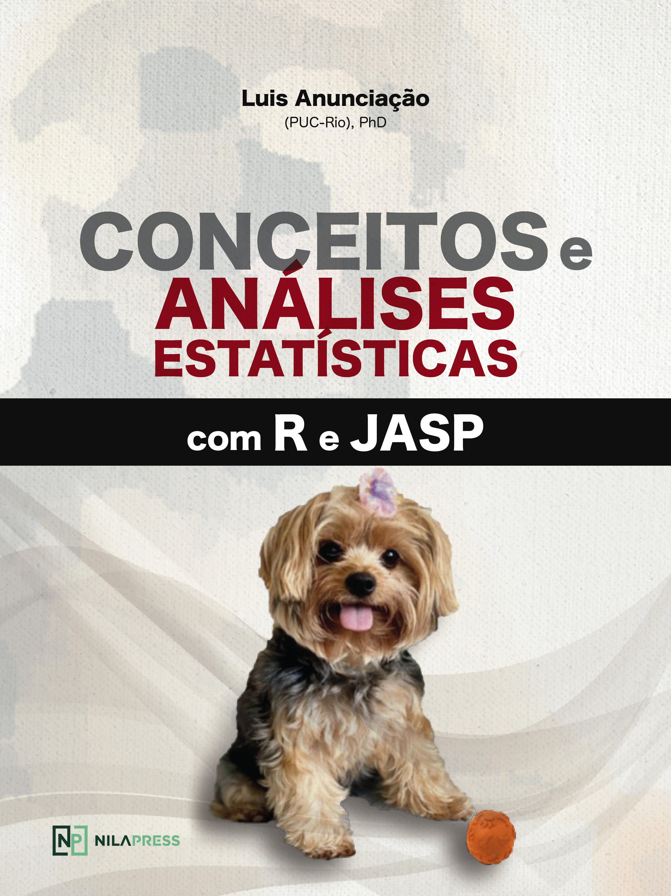

```{r, echo = FALSE }
knitr::opts_chunk$set(echo = TRUE, 
                      message = FALSE,
                      warning = FALSE,
                      fig.align="center")

```

# Prefácio

{width="60%"}

## Atenção

::: {.amazon }
Atenção: Os capítulos estão apenas parcialmente disponíveis.<br> Você pode adquirir o livro no site da Amazon, clicando [aqui](https://www.amazon.com.br/gp/product/B097CP7T9M?pf_rd_r=RDZC8XYMBC1WY69T0J8K&pf_rd_p=abb22e6b-8812-4b76-a424-5f0b098d2c90&pd_rd_r=ceec1911-f409-4acd-ac8f-2d5bc68dac43&pd_rd_w=wMUzJ&pd_rd_wg=ZK85a&ref_=pd_gw_unk).<br> Ao fazer isso, você estará apoiando este projeto e auxiliando no desenvolvimento de outros.<br> Última modificação: `r format(Sys.time(), '%d %B, %Y às %H:%M')`<br>
:::


Disciplinas do conjunto das ciências humanas e da saúde costumam fazer pesquisas extremamente complexas, em que a diferenciação dos fenômenos de interesse (sinal) daqueles que o distorcem ou o atrapalham (ruído) é, por vezes, bastante sutil e complicada. Uma vez que incerteza é sempre presente, é justamente nestas áreas que a estatística assume um importante papel. Métodos estatísticos permitem que os pesquisadores possam implementar maior robustez metodológica em seus estudos e com isso, terem maior segurança tanto nos resultados alcançados, como nas discussões e conclusões sugeridas.  

No entanto, apesar da inegável contribuição que a estatística traz para estas áreas, a ansiedade e o receio que ela gera em estudantes é um fato bem consolidado e conhecido pelos docentes não apenas de estatística, mas de métodos quantitativos no geral. Esse fenômeno traz um paradoxo bastante peculiar, podendo até mesmo fazer com que os estudantes de ciências humanas e da saúde – que são os que mais precisam dos recursos estatísticos em suas pesquisas – também sejam aqueles que têm menor interesse ou até mesmo a maior resistência em aprender esta matéria.  

A saída para este impasse não é fácil, mas um dos objetivos deste livro é providenciar uma possível solução. Durante todos os capítulos, o estudante será apresentado à uma pesquisa previamente publicada, em que as perguntas científicas se tornam o centro das atenções e as análises estatísticas aparecem como um enorme auxílio e suporte para que as respostas possam ser elaboradas. Dessa maneira, o estudante será estimulado a pensar e agir como um pesquisador, encontrando suas próprias soluções ou, ainda, aperfeiçoando aquelas que o livro propõe.   

O livro é integralmente feito no R e no JASP. Todos os seus códigos estão disponíveis para uso caso o estudante queira reproduzir as análises no R. Todas as telas do JASP também estão disponíveis visando guiar o estudante em cada etapa analítica. Acredito que essa abordagem mais pragmática possa despertar no estudante o interesse na utilização da estatística como uma importante ferramenta da ciência, mas também plantar uma primeira semente para que alguns também queiram entender como a ciência da estatística é formada.   

Este livro não seria possível sem a participação dos alunos da PUC-Rio, UFRJ e IBNeuro. Cada um, à sua maneira, contribuiu compartilhando suas dúvidas, questionamentos e reflexões, recursos valiosos para qualquer professor. O suporte e apoio dado por minha esposa também foram fundamentais em cada passo, seja os para frente ou também uns poucos para trás. Finalmente, se eu pude ver mais longe, foi por estar sobre ombros de um gigante, que tem nome e história. O Professor J. Landeira-Fernandez foi (e é) uma pessoa importante em cada etapa do processo, me oferecendo sempre um incentivo para continuar a seguir em frente e me apresentando às vias mais seguras.
Finalmente, apesar de grande ênfase em estudantes de graduação e pós-graduação, espero que este livro possa se tornar um importante recurso metodológico para os colegas que trabalham nesta batalha tão difícil, mas tão recompensante, que é ensinar Estatística.   

Luis Anunciação,
Rio de Janeiro, 20 de abril de 2021


## A proposta

Este livro nasceu como um dos principais e mais frutíferos resultados das aulas de graduação e pós-graduação ministradas por mim em alguns locais, mas com maior intensidade na PUC-Rio, UFRJ e IBNeuro. Por muito tempo, durante as aulas de Estatística aplicada à Psicologia e Bioestatística recorri a diferentes livros que, cada qual de forma particular, apresentavam conceitos de pesquisa, técnicas estatísticas e análise de dados.  

No entanto, acabei percebendo (ou tendo a impressão) de que eles apresentavam a estatística por diferentes atalhos pedagógicos, (1) sugerindo que pesquisa e estatística eram áreas distantes, (2) que toda estatística podia ser resumida por testes de hipóteses independentes entre si e que (3) situações envolvendo dados reais não tinham tanto interesse. No geral, pareceu-me que para eles apresentarem a estatística na ciência, era necessário distorcer pesadamente a ciência da estatística. Em função disso, nos últimos anos, eu fui sentindo necessidade de apresentar os conceitos de pesquisa e técnicas estatísticas de forma integrada, coesa e contando com dados reais.  

Conciliar estas condições em um único livro de maneira adequada é bastante improvável e esse livro opta por uma abordagem majoritariamente pragmática, mas que evita se distanciar de conceitos teóricos. O pragmatismo é fundamental para que o estudante consiga, rapidamente, entender os procedimentos relacionados à análise de dados e implementar técnicas estatísticas para tomar decisões. Quão antes o estudante entender a utilidade da estatística para resolver problemas, maior é a probabilidade de ele vir a gostar da área. Por sua vez, os aspectos teóricos são os alicerces para que o estudante possa perceber também que a estatística é uma ciência que, ao longo do tempo, conforme a tecnologia avançou, mais sólida e robusta foi se tornando.

Isso posto, este livro tem a proposta de ser um manual ou guia técnico, em que são apresentados conceitos de pesquisa e análises estatísticas utilizando os ambientes de programação R e o JASP e com especial aplicação em Psicologia e Bioestatística. Em cada capítulo, o estudante terá a oportunidade de acessar:

1.	Uma pesquisa científica, explicitando o problema e as hipóteses que a guiaram;  
2.	O artigo publicado com os resultados;   
3.	A base de dados em formato R ou CSV sem identificação para recriar os cenários dos artigos e poder ilustrar os novos conceitos discutidos;   
4.	Os métodos e as técnicas estatísticas pautadas na teoria discutida que possa responder às perguntas apresentadas nos cenários dos artigos e leve à uma tomada de decisão;   
5.	Recursos extras para aprofundamento em tópicos específicos;     
6.	Resolução de problemas par fixação do conteúdo discutido, ilustrados por provas externas da Área da Psicologia.  

Com isso, o livro oferece ao estudante um convite para uma trilha de aprendizado dentro do ecossistema da Psicologia, que o faça resolver problemas para uma tomada de decisão real, pautadas pelo referencial teórico discutido e pelos métodos e técnicas já oferecidos. Em função desses elementos, o foco do livro estará na resolução de problemas da área da Psicologia, a fim de tomar uma decisão mais acurada.
Espero que este livro possa ser útil a estudantes de graduação e pós-graduação, agradável a leitores de Estatística como de Psicologia e um recurso importante para outros docentes que, eventualmente, precisem de um material de apoio.


## Objetivo

O livro tem como objetivos (1) apresentar, (2) discutir e (3) operacionalizar conceitos de pesquisa e análises estatística de estudos publicados e de dados reais. Espera-se que qualquer o estudante consiga realizar todas as ações descritas no decorrer dos capítulos de maneira guiada e intuitiva. As sintaxes utilizadas no ambiente R e as telas de execução do JASP são integralmente disponíveis.

## Público-alvo

Estudantes de Psicologia e Bioestatística. As pesquisas e exemplos utilizados são mais aderentes a estas duas áreas. No entanto, os conceitos, métodos e técnicas estatísticas são interdisciplinares e, com isso, espera-se que estudantes de áreas como Educação, Administração e Economia também possam aprender com o livro.  

## Formato do livro

O livro foi pensado para ter uma estrutura (1) organizada, (2) linear e (3) formada por capítulos autossuficientes escritos para responder questões pontuais. Acredito que, assim, ele possa atender tanto estudantes interessados em ler a obra inteira, como aqueles que buscam informações mais específicas sobre um tópico particular.  

Este formato adotado tende a gerar uma percepção diferente entre aqueles que consultarem apenas um capítulo ou outro e aqueles que lerem o conteúdo por completo. Há uma maior chance de isto ocorrer em capítulos sobre testes estatísticos, uma vez que diversos testes estatísticos são casos particulares de outros. Alguns assuntos que parecem destoantes em uma leitura inicial, tornam-se articulados em outros capítulos.  

Muitos capítulos recebem o nome de testes de hipóteses (ex: Teste T ou Regressão). Isso foi intencional e visa auxiliar estudantes que precisem apenas de informações pontuais, bem como tende a enfraquecer a ideia de uma relação ponto a ponto tipicamente feita entre testes estatísticos e delineamentos específicos.


## Como usar este livro

O livro é formado por dois componentes: capítulos teóricos e capítulos voltados à análise de dados. Os capítulos teóricos reúnem alguns conceitos fundamentais de pesquisa e estatística, tais como tipos de variáveis, delineamento de pesquisa e técnicas de amostragem. Estes capítulos foram escritos pensando em alunos de graduação do curso de Psicologia.

Os capítulos analíticos são focados em testes de hipóteses e contam com uma metodologia direta ao ponto, em que atividades similares às realizadas nos artigos são demonstradas. Estes capítulos foram desenvolvidos para estudantes de pós-graduação.

A figura abaixo diagrama os dois componentes de forma aproximada.


## Pesquisas e dados

Neste livro, as seguintes pesquisas e seus materiais são utilizados:

-   ["Depression and Anxiety Symptoms in a Representative Sample of Undergraduate Students in Spain, Portugal, and Brazil"](https://doi.org/10.1590/0102.3772e36412)

-   ["Confirmatory analysis and normative tables for the Brazilian Ages and Stages Questionnaires: Social--Emotional"](https://onlinelibrary.wiley.com/doi/abs/10.1111/cch.12649)

-   [Psychometric properties of a short-term visual memory test (MEMORE)"](https://www.neuropsicolatina.org/index.php/Neuropsicologia_Latinoamericana/article/view/545)

-   ["A relação entre o nível de Empreendedorismo (TEG) e os aspectos sociodemográficos dos Taxistas cooperados da cidade de Santo André/São Paulo, Brasil"](https://www.metodista.br/revistas/revistas-metodista/index.php/REGS/article/view/6453)

-   ["Avaliação psicométrica em português do indicador de dor crônica de Helsinki em cães com sinais crônicos de osteoartrite"](https://www.scielo.br/scielo.php?script=sci_arttext&pid=S0102-09352019000100109)

-   ["Aspects Related to Body Image and Eating Behaviors in Healthy Brazilian Undergraduate Students"](https://www.researchgate.net/publication/323729370_Aspects_Related_to_Body_Image_and_Eating_Behaviors_in_Healthy_Brazilian_Undergraduate_Students)

-   "Parent-reported diagnosis of Attention Deficit Hyperactivity Disorder and psychostimulant use among children and adolescents: a population-based nationwide study"

-   "[Resilience and vulnerability in adolescents with primary headaches: a cross-sectional population-based study](https://pubmed.ncbi.nlm.nih.gov/33720394/)"

As bases são *Open Science*. Isso significa que elas são gratuitas e universalmente acessíveis para finalidades acadêmicas. Em cada capítulo, as bases irão aparecer na seção "Pesquisa", da seguinte maneira:

::: {.base }
A base desta pesquisa está disponível em formato **R (Rdata)** e em **CSV**, que é lido pelo JASP. Clique na opção desejada.

<strong>Base R: </strong> [Base R]()\
<strong>Base JASP: </strong> [Base CSV]()
:::

As bases em R tem formato .RData e as bases para o JASP tem formato .CSV.

## O R e os pacotes

O livro é integralmente desenvolvido pelo recurso de "programação letrada" no R Markdown, ou seja, ele entrelaça aspectos textuais e linhas de código. Em todos os capítulos, as funções nativas do R e do Tidyverse serão utilizadas. Caso alguém queira reproduzir as análises, será necessário apenas executar as linhas de código disponíveis no decorrer do livro.

O `tidyverse` costuma ter atualizações frequentes. Caso um alerta de `deprecated` seja apresentado, isso significa que a função utilizada foi parcialmente desativada, o que não costuma impactar nas análises.

## JASP

O JASP é um programa gratuito que tem sido cada vez mais utilizado em Psicologia. Ele é feito integralmente por código aberto e sua interface é bastante amigável e intuitiva. Ao instalar o JASP, o R também será instalado em seu computador e ficará no pano de fundo. Dessa maneira, todas as ações feitas por *Point and Click* no JASP, serão convertidas em linhas de código no R e apresentadas de maneira dinâmica no JASP.


Em todos os capítulos, telas do JASP serão apresentadas para que seja possível a reprodução integral de algumas análises. Da mesma forma que qualquer pacote estatístico, o JASP é atualizado frequentemente. Esse livro contou com a versão 0.14.1 e espero que futuras atualizações não comprometam a proposta do livro.

Atualizações pontuais de capítulos serão feitas visando parear o conteúdo do livro com as mudanças nos programas.

## Outros recursos

Em cada um dos capítulos, aplicações da estatística e referências bibliográficas serão apresentadas. Tenha em mente que há um debate intenso em diferentes conceitos de estatística, da mesma forma que muitas condições computacionais podem aparecer durante a execução das análises propostas. Eu recomendo fortemente a comunidade [stackoverflow](https://stackoverflow.com/) como um recurso pedagógico para auxiliar em ambos os cenários.

Questões relacionadas aos capítulos são listadas de forma a conectar o conteúdo do livro com exigências balizadas por critérios externos, tal como o ENADE e bancas de concurso.

## Capa

Por tradição, livros de Ciência de Dados e Estatística utilizam a imagem de algum animal na capa. Há livros com cachorros, papagaios, peixes, carangueijos, lagartos, etc. Esse livro não foge dessa regra e tem como capa a Jolie, a minha cachorrinha com a Anna. Ela foi indispensável para o <u>atraso</u> ao término deste livro.

## Versão do livro

Como todos os livros, este também tem uma história de desenvolvimento. A tabela abaixo apresenta a versão, a data de lançamento e algumas características importantes.

+--------+-----------------+--------------------------------------------------------------------------------------------------------------------------------------------------------+
| Versão | Data            | Características                                                                                                                                        |
+:=======+:================+:=======================================================================================================================================================+
| Beta 2 | Março, 2021     | Revisão textual parcialmente concluída. Fechado parceria com a Nila Press para comercialização da versão final do livro.                               |
+--------+-----------------+--------------------------------------------------------------------------------------------------------------------------------------------------------+
| Beta 1 | Fevereiro, 2021 | Primeira versão. Baixa revisão textual e dos conceitos estatísticos. <br>Erros são esperados. A utilização deve ser feita apenas de maneira incipiente |
+--------+-----------------+--------------------------------------------------------------------------------------------------------------------------------------------------------+

## Autor

[Luis Anunciação](http://lattes.cnpq.br/3982200733248687) é doutor em Psicometria pela Pontifícia Universidade Católica do Rio de Janeiro (PUC-Rio), com intercâmbio na University of Oregon, mestre em saúde pública pela Universidade do Estado do Rio de Janeiro e especialista em Neuropsicologia (IBNeuro) e Bioestatística (Johns Hopkins University). Atualmente, é professor do Departamento de Psicologia da PUC-Rio, coordenador da ANOVA e psicometrista da Nila Press, uma editora especialzada no desenvolvimento de instrumentos psicológicos. Desde 2016, trabalha intensamente com metodos estatísticos e análise de dados, sendo autor de mais de 30 artigos científicos sobre o tema, publicados majoritariamente em periódicos internacionais.  

## Revisão técnica

Este livro contou com a revisão técnica do Dr. J. Landeira-Fernandez (Doutor em Neurociências pela University of California - UCLA, Pesquisador 1A do CNPq) e Ms. Regina Albanense (Graduada em Matemática e Estatística e Mestre em Ciências). Dr. Landeira foi fundamental em tópicos envolvendo aspectos de pesquisa e análises estatísticas e Ms. Regina foi fundamental para revisão da modelagem matemática e revisão conceitual.

## Agradecimentos

Nenhum homem é uma ilha. Este livro só foi possível graças a um conjunto de pessoas que auxiliaram e fizeram uma profunda revisão do texto. Meus sinceros agradecimentos a (ao):

J. Landeira-Fernandez, PUC-Rio\
Regina Albanense, CONRE\
Cristiano Fernandes, PUC-Rio\
Danilo Assis Pereira, IBNeuro\
Anna Carolina de Almeida Portugal, UFRJ\
Emanuel Cordeiro, UFPE\
Jeovani Schmitt, Catarinense Federal Institute of Education, Science and Technology (IFC)   
Pedro Fernandez Tonso, aluno de graduação em Psicologia   
Alunos da PUC-Rio, UFRJ, IBNeuro e ANOVA


<div align='center'><a href='https://www.free-website-hit-counter.com'></a><br / ><small><a href='https://www.free-website-hit-counter.com' title="Free Website Hit Counter">Free website hit counter</a></small></div>
